<h1 align="left">
  <br>
  
  <br>
  HEI-Vs Engineering School - Industrial Automation Base
  <br>
</h1>

Cours AutB

Author: [Cédric Lenoir](mailto:cedric.lenoir@hevs.ch)

> Version 2025, V1.0

# LAB 01 Einführung in die Programmierung

*Anhang:*
-   [QuickStart_ctrlX_PLC to load and upload your first project from archive.](./QuickStart_ctrlX_PLC.md)


*Keywords:* **IDE HMI NODE-RED FUNCTION BLOCK CYCLIC TASK R_TRIG TON**

<br>

# Ziele
Erwerb von Kenntnissen über die verschiedenen Entwicklungssysteme, die während des Semesters verwendet werden, und Vertrautheit mit den Grundlagen der SPS-Programmierung und der Node-RED-Schnittstelle.


Um diese Ziele zu erreichen, werden die folgenden Übungen durchgeführt :

- Programmierung eines Flankensensors
- Programmierung einer Zeitverzögerung
- Programmierung eines Sinussignals
- Programmierung einer Schnittstelle auf Node-RED, um Variablen von/zur SPS zu lesen und zu schreiben.


<br>

  
# Überblick über die Umgebung  
## CtrlX Core
Das SPS-Programm wird in dem **ctrlX Core** ausgeführt, der auf jeder Einheit des Automatisierungslabors zur Verfügung steht. 
Der **ctrlX Core** läuft auf der Basis eines „Echtzeit“-Linux-Betriebssystems, das in eine elektrische Achssteuerung eingebettet ist (64-Bit Quad Core ARM-Prozessor).

<figure>
    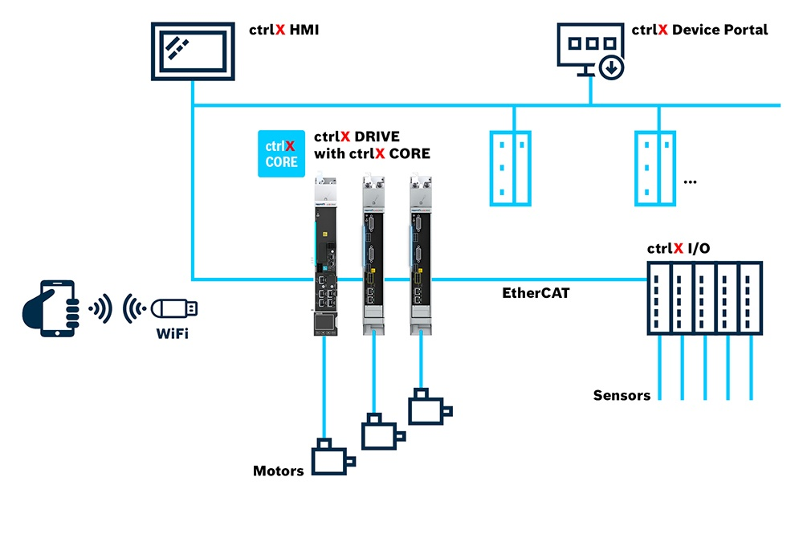
    <figcaption>CtrlX CORE Architecture drive based</figcaption>
</figure>

<br>


Der „ctrlX Core“ ist eine offene Architektur, die die Integration verschiedener Anwendungen und Dienste ermöglicht.

<figure>
    
    <figcaption>ctrlX CORE PLC Runtime Overview</figcaption>
</figure>


## Software

### ctrlX WORKS

CtrlX WORKS ist ein von Bosch Rexroth entwickeltes Softwarepaket zur Programmierung und Verwaltung von **ctrlX Core**-Systemen.
Sie ermöglicht die Verwaltung von realen und virtuellen Geräten, die mit dem Entwicklungs-PC verbunden sind.
ctrlX WORKS enthält eine integrierte Entwicklungsumgebung (IDE) für die Programmierung gemäß den in der Norm IEC 61131-3 beschriebenen Sprachen, die sich **ctrlX PLC Engineering** nennt.

> Beim Schreiben dieses Dokuments verwendete Version von CtrlX WORKS: 1.20.11

Link zum Herunterladen von ctrlX Works :
[Rexroth Store CtrlX Works 1.20.11](https://community.boschrexroth.com/ctrlx-os-store-apps-oc2pqqwn/post/ctrlx-works-xOJLFLUiK4NGm5H)


<br>

<figure>
    
    <figcaption>ctrlX WORKS - Device Management</figcaption>
</figure>


<br>

<figure>
    
    <figcaption>ctrlX PLC Engineering</figcaption>
</figure>

<br>


<br>

<u>HMI </u> :
Die heutigen HMI (**Human Machine Interface**) werden oft mit WEB-, HTML-, Java Script-Technologien entwickelt, die nicht Teil des SYND-Programms, Industrielle Systeme, sind.

Gegenwärtig basieren immer mehr HMI-Lösungen auf den Konzepten **Low Code** oder **No Code**. Die im Rahmen der praktischen Arbeit vorgeschlagene Lösung wird die **Node-Red**-Umgebung verwenden, die eine **Low-Code**-Lösung ist. Sie bietet die Möglichkeit, mit einem Minimum an Code auf die Daten der SPS zuzugreifen.

<figure>
    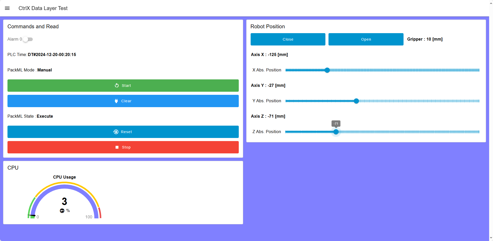
    <figcaption>Beispiel mit einem Dashboard von Node-RED</figcaption>
</figure>


<br>

### Node-Red

Node-RED ist ein flussbasiertes Entwicklungswerkzeug für die visuelle Programmierung, das hauptsächlich zur Verbindung von Hardwaregeräten, APIs und Diensten verwendet wird.
Es ermöglicht die Erstellung von Anwendungen durch das Verbinden von Bausteinen, die „Knoten“ genannt werden, in einer grafischen Benutzeroberfläche.

<figure>
     
</figure>

Einige Schlüsselmerkmale von Node-RED :

- Visuelle Programmierung: Verwendet eine Drag-and-Drop-Schnittstelle zur Erstellung von Datenströmen.
- Auf Node.js basierend: Dies ermöglicht die Verwendung einer Vielzahl von Node.js-Modulen.
- Erweiterbar: Knotenbibliothek, die regelmäßig mit neuen Funktionen aktualisiert wird.
- Open Source: Kostenlos und von einer aktiven Community gepflegt.


<br>

**Installation von Node-Red :**
  
<u>Voraussetzungen</u>:

Damit Node-RED funktionieren kann, muss zuvor die JavaScript-Laufzeitumgebung „Node.js“ installiert werden.
--> [Download Node.js](https://nodejs.org/en/download/current)

Die Installation dieser Umgebung wurde bereits auf den PCs des Automatisierungslabors durchgeführt.

Stattdessen **müssen Sie „Node-RED“ auf dem PC des Automatisierungslabors** installieren, indem Sie das folgende Verfahren befolgen.
Im Anschluss an diese Installation wird Ihre Node-RED-Umgebung installiert.
in Ihrem eigenen Benutzerprofil unter C:\Users[dein_benutzername].node-red.


<br>
<u>Installationsverfahren</u> : 
<br>


<br>
1) Installieren Sie Node-RED.

- Öffnen Sie die „Eingabeaufforderung“ (cmd.exe).
- Geben Sie den Befehl ein: ``npm install -g --unsafe-perm node-red``.
- Wenn Sie eine Nachricht wie *x packages are looking for funding* erhalten, ändern Sie den Befehl wie folgt: ``npm install --no-fund -g --unsafe-perm node-red``
- Überprüfen Sie die Versionen von Node.js und Node-RED mit dem Befehl: node-red --version.

Wenn die Softwareversionen nicht angezeigt werden, führen Sie den Installationsvorgang erneut durch, verwenden Sie jedoch „Windows PowerShell“ statt der „Eingabeaufforderung“.

<br> 
2) Starten Sie Node-RED  

- Öffnen Sie die Eingabeaufforderung (cmd.exe).
- Geben Sie den Befehl ein: node-red

<br>
3) Greifen Sie auf die Benutzeroberfläche von Node-RED zu.  

- Öffnen Sie den Browser.
- Geben Sie die URL ein: http://localhost:1880

<br>
4) Installieren Sie die Module, die wir für unsere Anwendung benötigen.

- Klicken Sie auf die drei horizontalen Striche in der oberen rechten Ecke
<figure>
    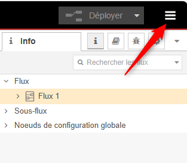 
</figure>

--> Die Palette verwalten  

--> Wählen Sie die Registerkarte „Installieren“. 

--> Installieren Sie die folgenden Module:  

    - @flowfuse/node-red-dashboard
    - node-red-contrib-ctrlx-automation


<br> 
5) Beenden Sie Node-RED.

Drücken Sie im Fenster der Eingabeaufforderung die Tastenkombination Ctrl + C oder schließen Sie das Fenster der Eingabeaufforderung.


*Bitte beachten Sie: Nachdem Sie Node-RED zum ersten Mal gestartet haben, werden die Konfigurationsdateien und Streams unter C:\Users\[ton_nom_utilisateur]\.node-red.

<br> 
6) Kopieren Sie die zur Verfügung gestellte Basisdatei „flows.json“.

Ersetze die Datei „flows.json“, die sich im Verzeichnis C:\Users\[ton_benutzername]\.node-red befindet, durch die Datei „flows.json“, die in GitLab zur Verfügung gestellt wird.

<br>
7) Node-Red neu starten --> siehe Punkt 2)
  
<br>
<br>
8) Auf die Benutzeroberfläche von Node-RED zugreifen --> siehe Punkt 3) 

<br><br>
Sie sollten die folgende Benutzeroberfläche erhalten :


<figure>
    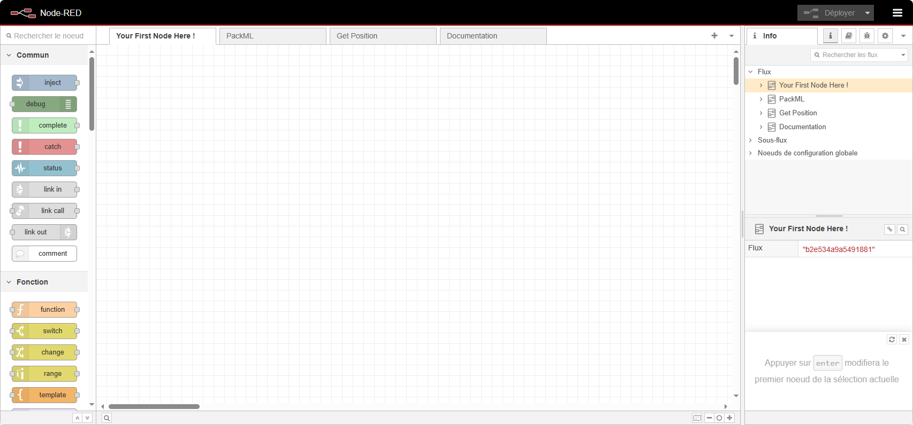 
</figure>


<br>


# Ihr erstes Programm

<u>Ziel </u> :
Einen Zähler in eine Aufgabe implementieren und überprüfen, ob die Aufgabe zyklisch ausgeführt wird.


<u>Voraussetzungen </u> :
Öffnen Sie ctrlX PLC Engineering und führen Sie die folgende Prozedur durch:
    --> [Vorgehensweise, um das Projektarchiv hier zu laden.
:](QuickStart_ctrlX_PLC.md).


## Implementieren Sie das folgende Programm in der SPS.


```iecst
PROGRAM PLC_PRG
VAR
    iCount    : INT := 3;
END_VAR

iCount := iCount + 1;
```


<br>

<u>Vorgehen </u>:
1. Wählen Sie PRG_Student (PRG).
2. Schreiben Sie das Programm.
3. Kompilieren Sie es.
4. Das Programm in die SPS laden.
5. Das Programm starten.


<figure>
    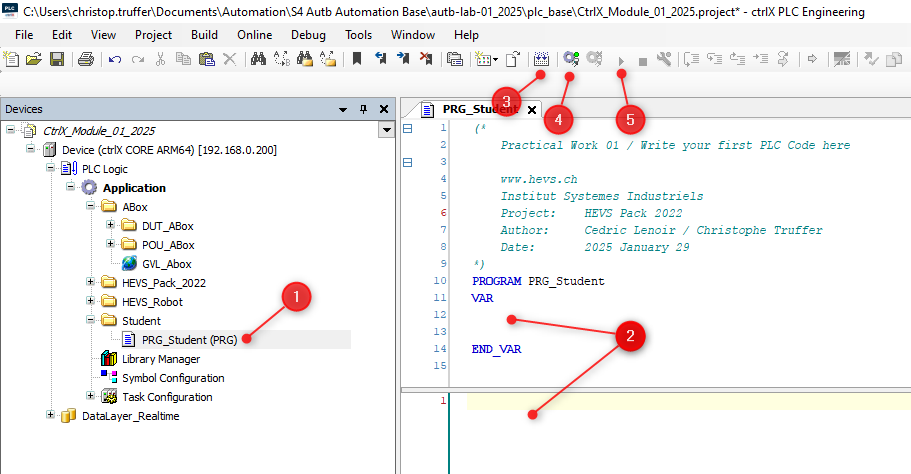
    <figcaption>Mein erstes Programm</figcaption>
</figure>

<br>

> Im oberen Teil des Fensters werden die Variablen definiert und im unteren Teil wird das Programm geschrieben.
<br>

<figure>
    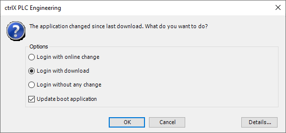
    <figcaption>Auswählen "Login with download"</figcaption>
</figure>


<br>

Damit auf eine Variable von Node-RED aus zugegriffen werden kann, muss der Compiler darüber informiert werden.


<u>Vorgehen </u>:

1. Wählen Sie **Symbol Konfiguration**.
2. Aktivieren Sie die Variable „iCount“.
3. Klicken Sie auf „Build“.
   

<figure>
    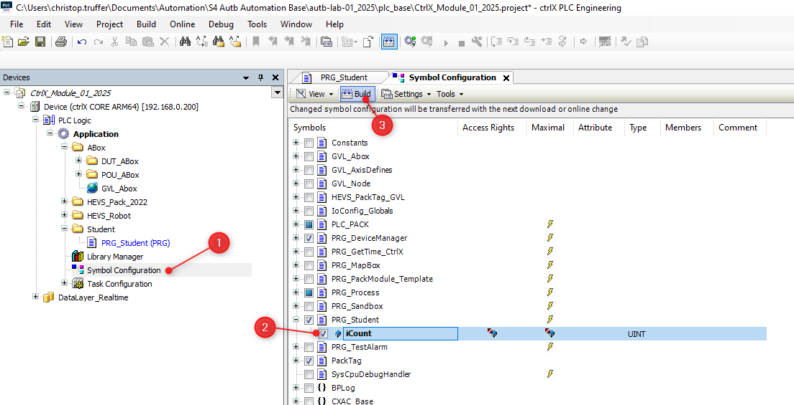
    <figcaption>Configure Symbol Configuration</figcaption>
</figure>

> Wenn das Symbol **Symbol Konfiguration** nicht vorhanden ist, müssen Sie es hinzufügen, indem Sie in IDE --> Tab --> Project --> Add Object --> Symbol Configuration...


Beim nächsten Herunterladen des Programms wird die Variable „iCount“ im **Data Layer** (*) des CtrlX-Core von Node-RED aus zugänglich sein.

(*) Der Data Layer fungiert als Rückgrat in der ctrlX CORE-Architektur, das den Austausch von „Echtzeit“- und „Nicht-Echtzeit“-Daten zwischen verschiedenen Anwendungen sicherstellt.
Der Data Layer speichert die Daten nicht direkt, sondern fungiert als Vermittler, der ihren Speicherort und ihre Struktur kennt.


<br>

## Implementieren Sie das folgende Programm in Node-RED.

1) Starten Sie Node-RED.
- Öffne die Eingabeaufforderung (cmd.exe).
- Geben Sie den Befehl ein: node-red

<br>

2) Rufen Sie die Benutzeroberfläche von Node-RED auf.
- Öffnen Sie den Browser.
- Geben Sie die URL : http://localhost:1880

<br>

3) Rufen Sie die Seite „Your First Node Here!“ auf.

<br>

<figure>
    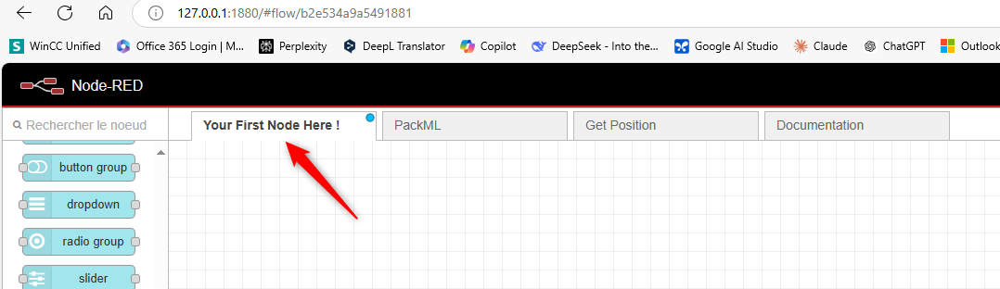
    <figcaption>Your first node</figcaption>
</figure>


<br>

Fügen Sie den Knoten **Data Layer Subscribe** hinzu und konfigurieren Sie ihn wie folgt: 

<figure>
    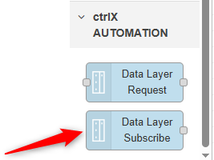
    <figcaption>Auswählen Knoten DataLayer Subscribe</figcaption>
</figure>


<br>

- Klicken Sie auf die Schaltfläche „+“ rechts von „Subscription“.
- Wählen Sie unter „Device“ die Option „Nodered“.
- Bei „Name“ einen Namen hinzufügen (z. B. iCount)

<figure>
    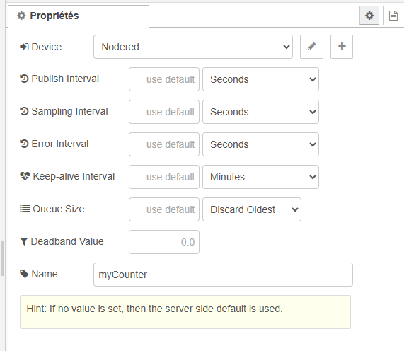
    <figcaption>Eigenschaften node „DataLayer Subscribe“.</figcaption>
</figure>


<br>

Wählen Sie unter „Path“ den Eintrag „iCount“.


<figure>
    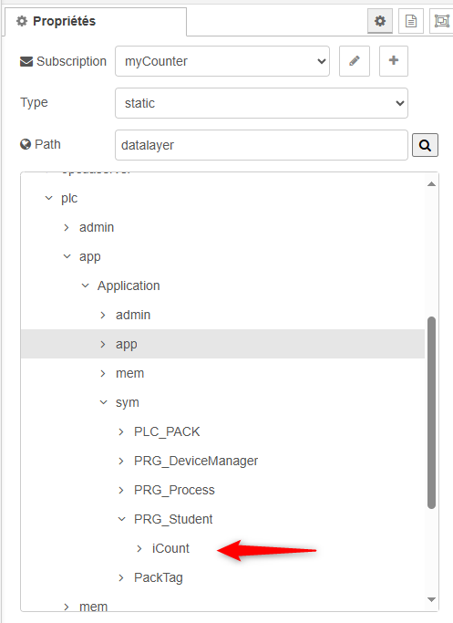
    <figcaption>Propriétés "node DataLayer Subscribe"</figcaption>
</figure>


Fügen Sie den Knoten **gauge** hinzu und konfigurieren Sie ihn wie folgt: 

<br>

<figure>
    
    <figcaption>Auswahl Gauge-Knoten</figcaption>
</figure>

<br>

<figure>
    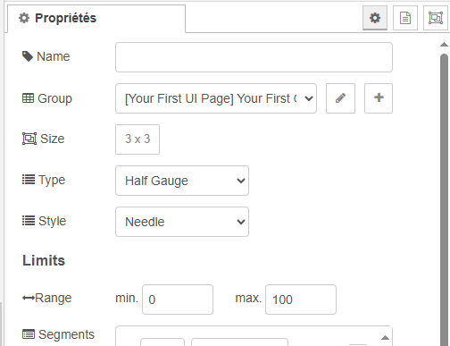
    <figcaption>Eigenschaften Knoten gauge</figcaption>
</figure>


<br>


Verbinden Sie dann diese beiden Knoten (1) und klicken Sie auf die Schaltfläche „Verteilen“ (2).

<figure>
    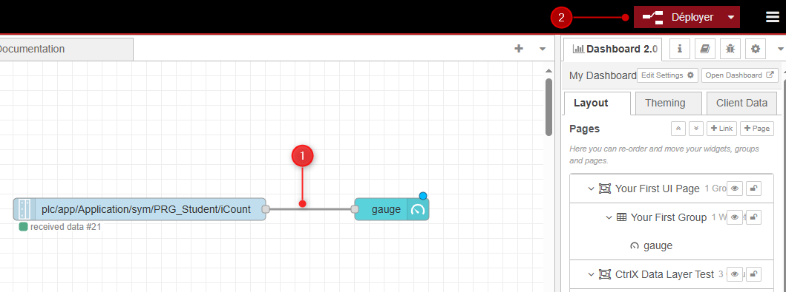
    <figcaption>Knoten miteinander verbunden</figcaption>
</figure>


<br>

Dashboard starten
<figure>
    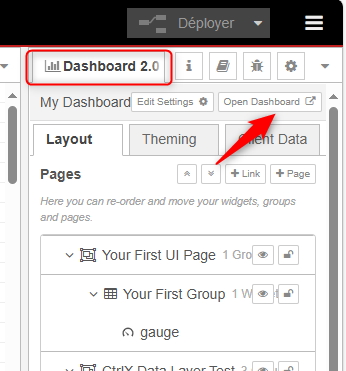
    <figcaption>Dashboard starten</figcaption>
</figure>


<br>

<u>Ergebnis </u> :

<figure>
    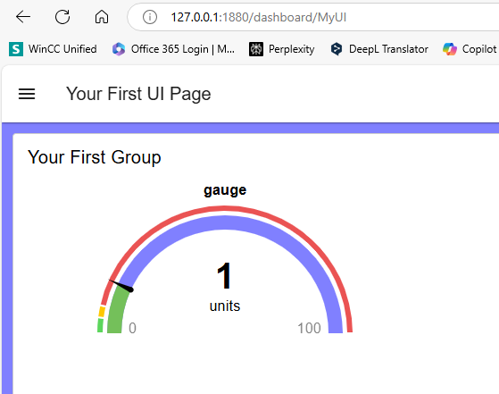
    <figcaption>Anzeige des Zählers auf dem Dashboard</figcaption>
</figure>


<br>


**Well done, your first program is ready !**


# Programmiere einen Flankenmelder.


<u>Ziel</u>:
Das Förderband zu starten, sobald eine steigende Flanke auf einem **start**-Drucktaste erkannt wird, und es zu stoppen, sobald eine steigende Flanke auf einem **stop**-Drucktaste erkannt wird. Die beiden Drucktasten werden auf Node-RED implementiert.

<br>

<u>Voraussetzungen </u> :
- Schließen Sie den Das Förderband an die SPS „Siemens“ an.
- Schalte das Modell mit dem Druckknopf „S5“ ein.

<br>

<figure>
    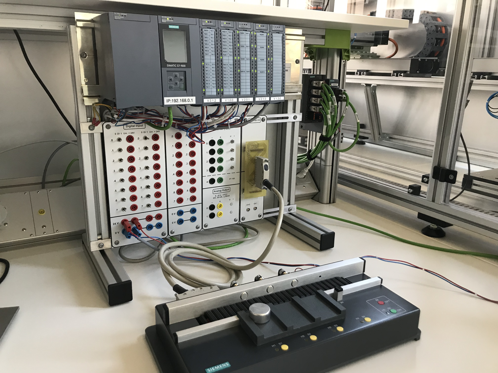
    <figcaption>Das Förderband</figcaption>
</figure>


<br>


<u>Vorwort</u> :
Die Erkennung von steigenden oder fallenden Flanken kann mithilfe des Funktionsbausteins **R_TRIG** (Rising Trigger) bzw. des Funktionsbausteins **F_TRIG** (Falling Trigger) programmiert werden.

<u>Funktionsprinzip von R_TRIG </u>:
Dieser Funktionsblock besteht aus:
- 1 Eingang: CLK (BOOL)
- 1 Ausgang: Q (BOOL)
 
Wenn am Eingang CLK eine steigende Flanke erkannt wird, wechselt der Ausgang Q für einen einzigen Programmausführungszyklus auf TRUE.


<br>


<br>

## Vervollständige das SPS-Programm mit dem unten stehenden Code

```iecst

PROGRAM PRG_Student
VAR
    iCount : UINT := 3;
    startFromNodeRed : BOOL;
    stopFromNodeRed : BOOL;
    rTrigStart	: R_TRIG;
        rTrigStop   : R_TRIG;

END_VAR

```


```iecst


// Start conveyor
IF rTrigStart.Q THEN
    GVL_Abox.uaAboxInterface.uaDigitalOut.Output_0_4 := TRUE;
END_IF

// Stop conveyor
IF rTrigStop.Q THEN
    GVL_Abox.uaAboxInterface.uaDigitalOut.Output_0_4 := FALSE;
END_IF


// Call function block
rTrigStart(CLK:=startFromNodeRed);
rTrigStop(CLK:=stopFromNodeRed);

```

<br>

**N.B.**: Die strukturierte Variable „GVL_Abox.uaAboxInterface.uaDigitalOut.Output_0_4“ wird der Steuerung des Motors „Richtung rechts“ des Förderbandes des Transportbandes zugewiesen.

Anschließend muss der Zugriff auf die Variablen „startFromNodeRed“ und „stopFromNodeRed“
in „Symbol Configuration“ geben, damit Node-RED sie verwenden kann (Vorgehensweise: siehe vorherige Übung).

## Vervollständigen Sie das Node-RED-Programm mit dem folgenden Code

<figure>
    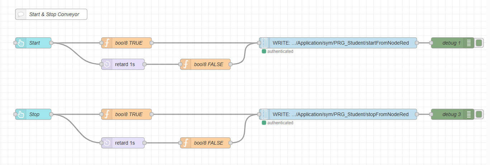
    <figcaption>Start & Stop Förderband</figcaption>
</figure>


<br>

Eigenschaft von Tasten

<figure>
    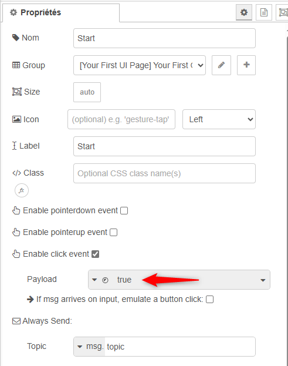
    <figcaption>Eigenschaften von Knoten Button</figcaption>
</figure>

<br>

Eigenschaft der Funktion „bool8 TRUE“.


<figure>
    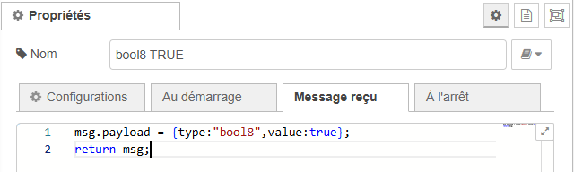
    <figcaption>Eigenschaften der Funktion "bool8 TRUE"</figcaption>
</figure>


<br>


<br>

Dashboard starten
<figure>
    
    <figcaption>Dashboard starten</figcaption>
</figure>


<br>

<u>Ergebnis </u> :


<figure>
    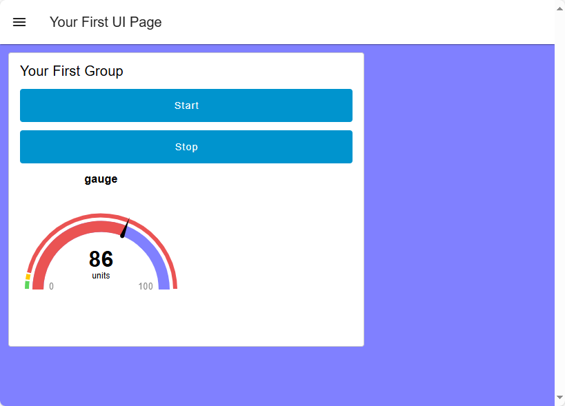
    <figcaption>Dashboard Start Stop Förderband</figcaption>
</figure>


<br>


# Programmiere einen Timer.

<u>Ziel</u>:
Ergänzen Sie das Programm so, dass das Förderband anhält, wenn die **Stopp-Taste** gedrückt wurde oder eine **bestimmte Zeitdauer** verstrichen ist.

<br>

<u>Vorwort</u> :

Timer sind Funktionsblöcke, die in der **PLC**-Programmierung sehr häufig verwendet werden. Man unterscheidet die folgenden drei Typen:

1) **TON** (Timer On-Delay): Dies ist eine Einschaltverzögerung. Er aktiviert seinen Ausgang nach einer programmierten Zeit, wenn sein Eingang aktiviert ist.
   
2) **TOF** (Timer Off-Delay): Hierbei handelt es sich um eine Ausschaltverzögerung. Sie hält den Ausgang für eine bestimmte Zeit aktiv, nachdem der Eingang deaktiviert wurde.
   
3) **TP** (Timer Pulse): Diese Zeitverzögerung erzeugt einen Impuls mit fester Dauer. Sobald er durch eine steigende Flanke an seinem Eingang ausgelöst wird, schaltet er seinen Ausgang für eine bestimmte Zeit ein, unabhängig von nachfolgenden Änderungen am Eingang.

Jeder Timer-Typ hat die folgenden Parameter:
- IN: Boolescher Eingang zum Auslösen des Timers.
- PT: Programmierte Zeit (Preset Time)
- Q: Boolescher Ausgang
- ET: Verstrichene Zeit (Elapsed Time)

Die Parameter „PT“ und „ET“ haben den Datentyp **TIME**.
Beispiel für das Format: T#5d4h3m2s1ms

<br>


## Vervollständigen Sie das SPS-Programm, indem Sie die folgende Variablendeklaration hinzufügen

```iecst
PROGRAM PRG_Student
VAR
    ...

    tonConveyorStop : TON;
END_VAR
```


<br>

## Vervollständigen Sie das Node-RED-Programm mit dem unten stehenden Code.
Ziel ist es, die abgelaufene Zeit des „TON“-Zeitgebers auf Node-RED anzuzeigen.


<br>

<figure>
    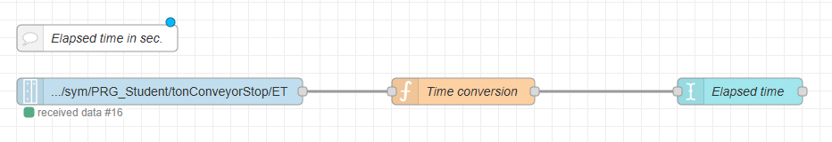
    <figcaption>Abgelaufene Zeit in Sekunden</figcaption>
</figure>

<br>

<figure>
    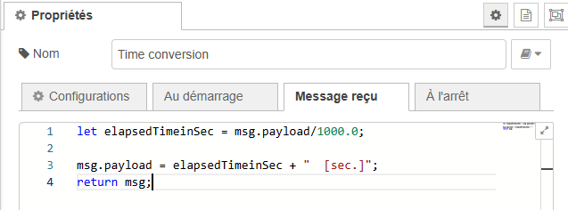
    <figcaption>Eigenschaften des Knotens „Time conversion“ </figcaption>
</figure>


<br>
<u>Ergebnis </u>:

<br>

<figure>
    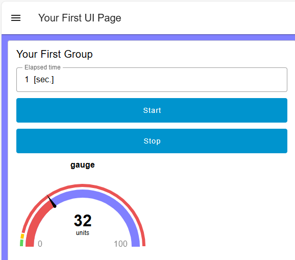
    <figcaption>Abgelaufene Dauer des TON-Timers“.</figcaption>
</figure>


# Programmiere einen Generator für ein Sinussignal.

<u>Ziel</u> :
Vervollständige das Programm, indem du die Erzeugung eines Sinussignals und dessen Darstellung in einem Diagramm hinzufügst.

<br>

<u>Vorwort </u> :

Das Programm „PRG“ (1) wird von der Aufgabe „MainTask“ (2) zyklisch aufgerufen.


<figure>
    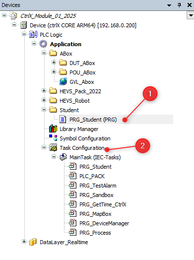
    <figcaption>Aufruf des Programms „PRG“ durch die Aufgabe „MainTask“.</figcaption>
</figure>


<br>

Überprüfen Sie die Zykluszeit der Hauptaufgabe „MainTask“, die bei ``40 [ms]`` liegen sollte.

<figure>
    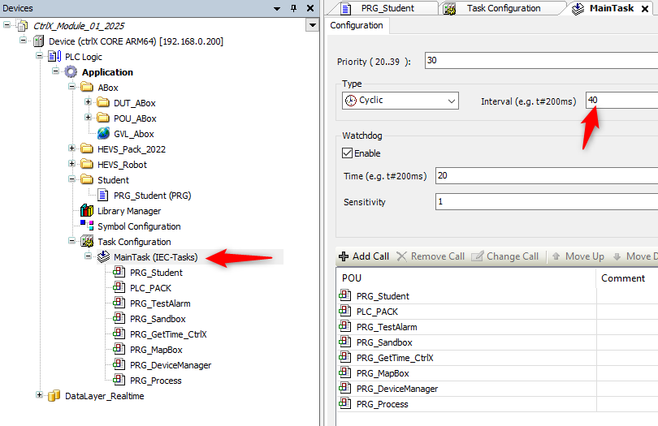
    <figcaption>Zykluszeit der Hauptaufgabe</figcaption>
</figure>


<br>


## Vervollständigen Sie das SPS-Programm, indem Sie die Deklaration der folgenden Variablen hinzufügen

<u>Grundlegende Daten</u> : 

- Signalamplitude : ```10 [-]```.
- Frequenz des Signals : ```0,1 [Hz]```.
- Pi ist als Konstante definiert.


```iecst
PROGRAM PRG_Student
VAR
    ...
    
    amplitude : REAL := 10.0;
    frequency_Hz : REAL := 0.1;
    sampleTime_s : REAL := 0.04;
    t_s : REAL := 0.0;
    sinusSignal : REAL;
    
END_VAR

VAR CONSTANT
    PI : REAL := 3.14159;
END_VAR

```


<br>

## Vervollständige das Node-RED-Programm mit dem untenstehenden Code


<figure>
    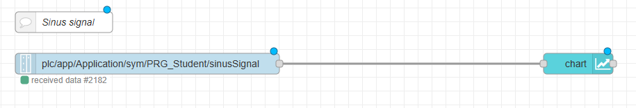
    <figcaption>Grafik in Node-RED</figcaption>
</figure>


<br>

<u>Ergebnis </u> : 


<figure>
    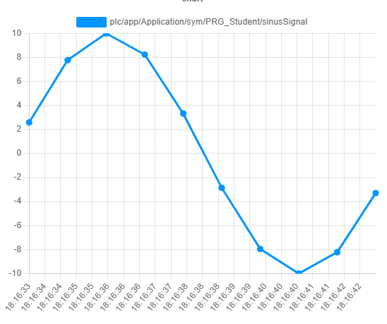
    <figcaption>Sinussignal auf Node-RED</figcaption>
</figure>

## Fügen Sie das Werkzeug „Trace“ in CtrlX PLC hinzu.

Fügen Sie das „Trace“-Werkzeug in CtrlX PLC hinzu und visualisieren Sie das Sinussignal.
<figure>
    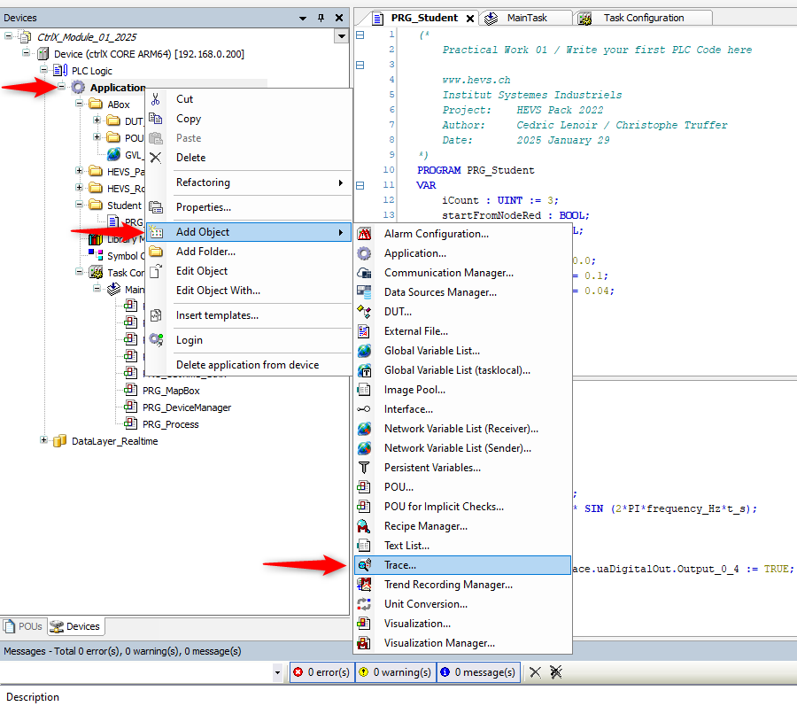
    <figcaption>"Trace" Tool in CtrlX PLC</figcaption>
</figure>


<br>

<u>Ergebnis </u> : 


<figure>
    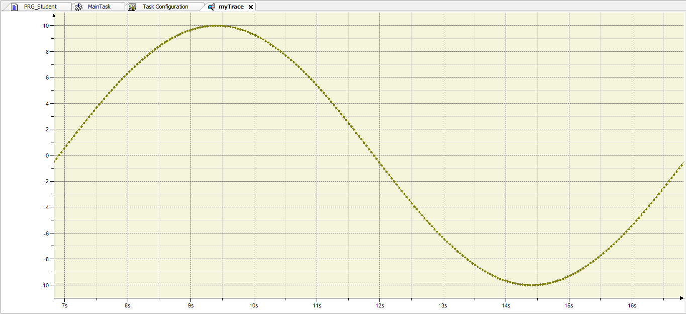
    <figcaption>Sinussignal mit dem „Trace“-Tool</figcaption>
</figure>


<br>

Was stellen Sie fest, wenn Sie das auf „Node-RED“ angezeigte Sinussignal mit dem mit „Trace“ angezeigten Signal vergleichen ?


# Information

> Auf Anfrage kann die Software „ctrlX Works“ zur Installation auf Ihrem Laptop (nur Windows!) zur Verfügung gestellt werden.
> 

