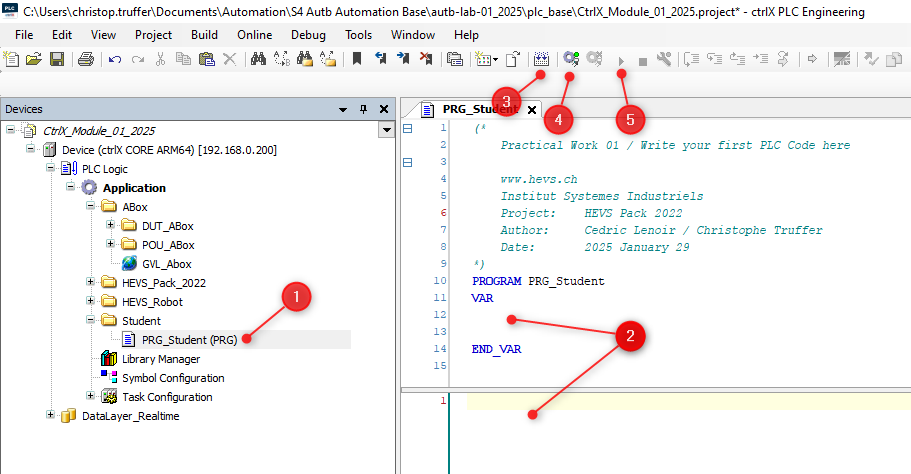
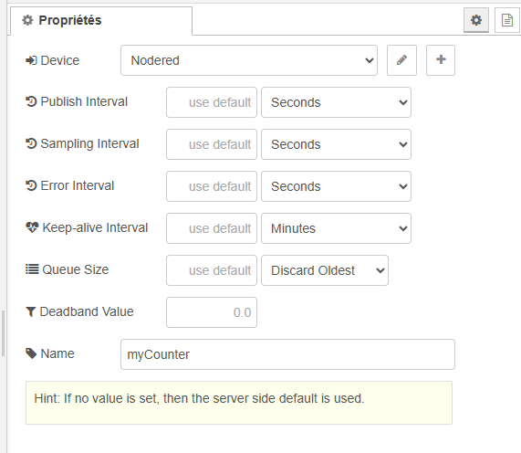
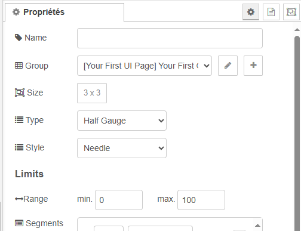
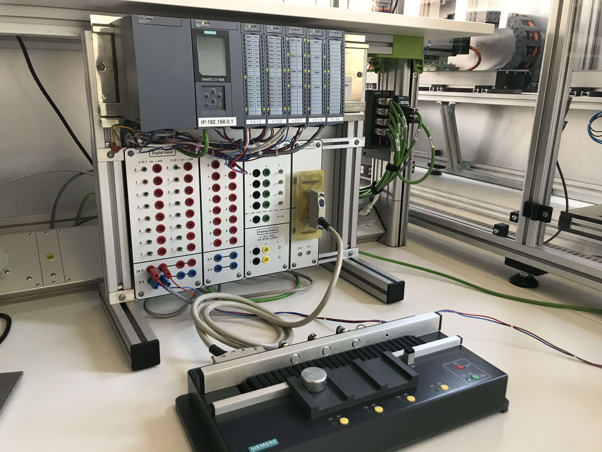
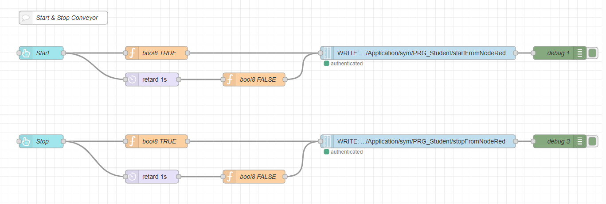
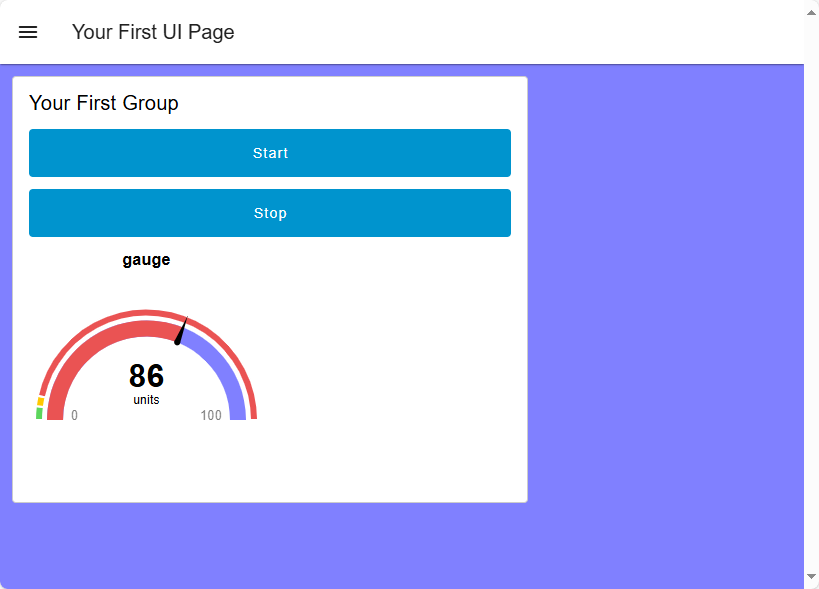
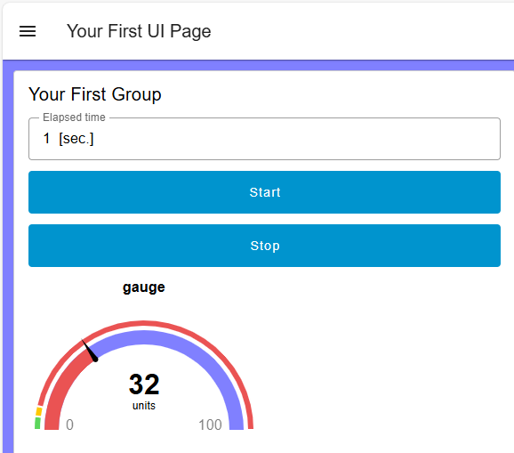
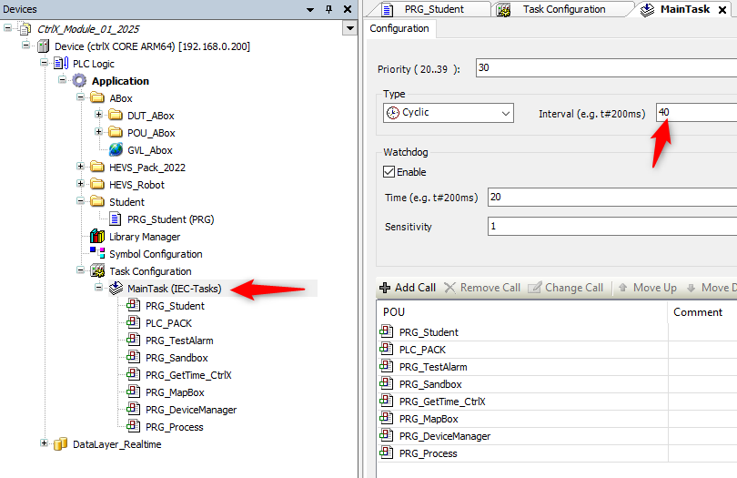
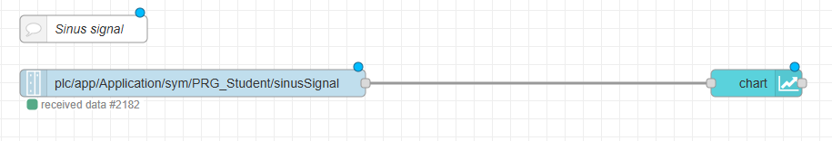
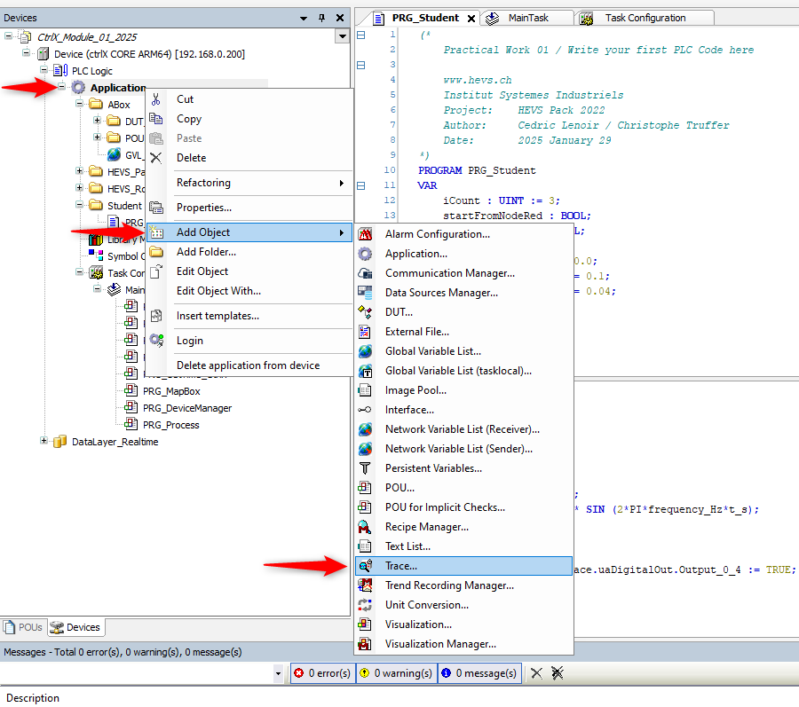

<h1 align="left">
  <br>
  
  <br>
  HEI-Vs Engineering School - Industrial Automation Base
  <br>
</h1>

Cours AutB

Author: [Cédric Lenoir](mailto:cedric.lenoir@hevs.ch)

> Version 2025, V1.0

# LAB 01 Introduction à la programmation

*Annexe:*
-   [QuickStart_ctrlX_PLC to load and upload your first project from archive.](./QuickStart_ctrlX_PLC.md)


*Keywords:* **IDE HMI NODE-RED FUNCTION BLOCK CYCLIC TASK R_TRIG TON**

# Objectifs
Acquérir des connaissances des différents systèmes de développement utilisés pendant le semestre et se familiariser avec les bases de la programmation PLC et de l'interface Node-RED.


Afin d'atteindre ces objectifs, les exercices suivants seront effectués :

- Programmation d'un détecteur de front
- Programmation d'une temporisation
- Programmation d'un signal sinusoïdal
- Programmation d'une interface sur Node-RED pour lire et écrire des variables depuis/vers le PLC
  
# Présentation de l'environnement  
## CtrlX Core
Le programme PLC sera exécuté dans le **ctrlX Core** à disposition sur chaque unité du laboratoire d'automatisation. 
Le **ctrlX Core** fonctionne sur la base d'un système d'exploitation Linux "temps réel" embarqué dans une commande électrique d'axe (Processeur 64 Bit Quad Core ARM).

<figure>
    
    <figcaption>CtrlX CORE Architecture drive based</figcaption>
</figure>

<br>


Le "ctrlX Core" est une architecture ouverte qui permet l'intégration de diverses applications et services.

<figure>
    
    <figcaption>ctrlX CORE PLC Runtime Overview</figcaption>
</figure>


## Logiciels

### ctrlX WORKS

CtrlX WORKS est une suite logicielle développée par Bosch Rexroth pour programmer et gérer les systèmes **ctrlX Core**.
Elle permet la gestion des appareils, qu'ils soient réels ou virtuels, connectés au PC de développement.
ctrlX WORKS inclut un environnement de développement intégré (IDE) pour la programmation selon les langages décrits dans la norme IEC 61131-3 qui se nomme **ctrlX PLC Engineering**.

> Version de CtrlX WORKS utilisée lors de l'écriture de ce document : 1.20.11

Lien pour télécharger ctrlX Works :
[Rexroth Store CtrlX Works 1.20.11](https://community.boschrexroth.com/ctrlx-os-store-apps-oc2pqqwn/post/ctrlx-works-xOJLFLUiK4NGm5H)


<br>

<figure>
    
    <figcaption>ctrlX WORKS - Device Management</figcaption>
</figure>


<br>

<figure>
    
    <figcaption>ctrlX PLC Engineering</figcaption>
</figure>

<br>


<br>

<u>HMI </u> :
Les HMI (**Human Machine Interface**) actuels sont souvent développées avec des technologies WEB, HTML, Java Script qui ne sont pas des technologies qui font partie du programme SYND, Systèmes Industriels.

Actuellement, de plus en plus de solutions de HMI sont basées sur des notions de **Low Code** ou **No Code**. La solution proposée dans le cadre des travaux pratiques utilisera l'environnement **Node-Red** qui est une solution **Low Code**. Elle offre la possibilité d'accéder aux données du PLC avec un minimum de code.


<figure>
    
    <figcaption>Exemple avec un Dashboard de Node-RED</figcaption>
</figure>


<br>

### Node-Red

Node-RED est un outil de développement basé sur le flux pour la programmation visuelle, principalement utilisé pour connecter des dispositifs matériels, des API et des services.
Il permet de créer des applications en reliant des blocs de construction appelés "nœuds" dans une interface utilisateur graphique.

<figure>
     
</figure>

Quelques caractéristiques clés de Node-RED :

- Programmation visuelle : Utilise une interface glisser-déposer pour créer des flux de données.
- Basé sur Node.js : Ce qui permet d'utiliser une grande variété de modules Node.js.
- Extensible : Bibliothèque de nœuds régulièrement actualisée avec de nouvelles fonctionnalités.
- Open source : Gratuit et maintenu par une communauté active.


<br>

**Installation de Node-Red :**
  
<u>Prérequis</u> :

Afin que Node-RED puisse fonctionner, il est nécessaire d'avoir installé préalablement l'environnement d'exécution JavaScript "Node.js".
--> [Download Node.js](https://nodejs.org/en/download/current)

L'installation de cet environnement a déjà été effectuée sur les PC du laboratoire d'automatisation.

Par contre, **vous devez installer "Node-RED" sur le PC du laboratoire d'automatisation** en suivant la procédure ci-après.
A la suite de cette installation, votre environnement Node-RED sera installé
dans votre propre profil utilisateur sous C:\Users[ton_nom_utilisateur].node-red.

<br>
<u>Procédure d'installation</u> :  
<br>


<br>
1) Installer Node-RED

- Ouvrir "l'invite de commande" (cmd.exe)
- Entrer la commande : ``npm install -g --unsafe-perm node-red``
- Si vous recevez un message du type: *x packages are looking for funding*, modifiez la commande ainsi: ``npm install --no-fund -g --unsafe-perm node-red``
- Vérifier la version de Node.js et de Node-RED avec la commande : node-red --version

Si les versions des logiciels ne s'affichent pas, effectuer à nouveau la procédure d'installation mais en utilisant "Windows PowerShell" au lieu de "l'invite de commande".

<br> 
2) Démarrer de Node-RED  

- Ouvrir l'invite de commande (cmd.exe)
- Entrer la commande : node-red

<br>
3) Accèder à l'interface utilisateur de Node-RED  

- Ouvrir le navigateur
- Entrer l'URL : http://localhost:1880

<br>
4) Installer les modules nécessaires à notre application

- Cliquer sur les 3 traits horizontaux en haut à droite
<figure>
     
</figure>

--> Gérer la palette  

--> Sélectionner l'onglet "Installer" 

--> Installer les modules suivants :  

    - @flowfuse/node-red-dashboard
    - node-red-contrib-ctrlx-automation


<br> 
5) Arrêter Node-RED

Dans la fenêtre de l'invite de commande, appuyer sur Ctrl + C ou fermer la fenètre de l'invite de commande


**N.B.** : Après avoir démarré Node-RED pour la première fois, les fichiers de configuration et les flux seront stockés sous : C:\Users\[ton_nom_utilisateur]\.node-red.

<br> 
6) Copier le fichier de base "flows.json" mis à disposition

Remplacer le fichier "flows.json" qui se trouve dans le répertoire C:\Users\[ton_nom_utilisateur]\.node-red par le fichier "flows.json" mise à disposition dans GitLab.

<br>
7) Redémarrer Node-Red --> voir point 2)
  
<br>
<br>
8) Accèder à l'interface utilisateur de Node-RED --> voir point 3) 

<br><br>
Vous devriez obtenir l'interface utilisateur suivante :


<figure>
     
</figure>


<br>


# Votre premier programme

<u>Objectif </u> :
Implémenter un compteur dans une tâche et vérifier que cette dernière est exécutée cyliquement.


<u>Prérequis </u> :
Ouvrir ctrlX PLC Engineering et effectuer la procédure suivante :
    --> [Procédure pour charger l'archive du projet ici](QuickStart_ctrlX_PLC.md).


## Implémenter le programme suivant dans le PLC


```iecst
PROGRAM PLC_PRG
VAR
    iCount    : INT := 3;
END_VAR

iCount := iCount + 1;
```


<br>

<u>Marche à suivre </u>:
1. Sélectionner PRG_Student (PRG).
2. Ecrire le programme.
3. Compiler.
4. Charger le programme dans le PLC.
5. Démarrer le programme.


<figure>
    
    <figcaption>Mon premier programme</figcaption>
</figure>

<br>

> La partie supérieure de la fenêtre permet de définir les variables et la partie inférieure à écrire le programme.

<br>

<figure>
    
    <figcaption>Selectionnner "Login with download"</figcaption>
</figure>


<br>

Pour qu'une variable soit accessible depuis Node-RED, il faut en informer le compilateur.


<u>Marche à suivre </u>:

1. Sélectionner **Symbol Configuration**
2. Sélectionner la variable "iCount"
3. Cliquer sur "Build".
   

<figure>
    
    <figcaption>Configure Symbol Configuration</figcaption>
</figure>

> Si l'icône **Symbol Configuration** n'est pas présente, il faut l'ajouter en allant dans IDE --> Tab --> Project --> Add Object --> Symbol Configuration...


Lors du prochain téléchargement du programme, la variable "iCount" sera accessible dans le **Data Layer** (*) du CtrlX-Core depuis Node-RED.

(*) Le Data Layer agit comme une colonne vertébrale dans l'architecture ctrlX CORE assurant l'échange de données "temps réel" et "non temps réel" entre les différentes applications.
Le Data Layer ne stocke pas directement les données, mais agit comme un intermédiaire connaissant leur emplacement et leur structure.


<br>

## Implémenter le programme suivant dans Node-RED

1) Démarrer Node-RED
- Ouvrir l'invite de commande (cmd.exe)
- Entrer la commande : node-red

<br>

2) Accèder à l'interface utilisateur de Node-RED
- Ouvrir le navigateur
- Entrer l'URL : http://localhost:1880

<br>

3) Accèder à la page "Your First Node Here !"

<br>

<figure>
    
    <figcaption>Your first node</figcaption>
</figure>


<br>

Ajouter le noeud **Data Layer Subscribe** et le configurer comme suit : 

<figure>
    
    <figcaption>Sélection noeud DataLayer Subscribe</figcaption>
</figure>


<br>

- Cliquer sur le bouton "+" à droite de "Subscription"
- Dans "Device", sélectionner "Nodered"
- Dans "Name", ajouter un nom (par exemple : iCount)

<figure>
    
    <figcaption>Propriétés node "DataLayer Subscribe"</figcaption>
</figure>


<br>

Dans "Path", sélectionner "iCount".


<figure>
    
    <figcaption>Propriétés "node DataLayer Subscribe"</figcaption>
</figure>


Ajouter le noeud **gauge** et le configurer comme suit : 

<br>

<figure>
    
    <figcaption>Sélection noeud gauge</figcaption>
</figure>

<br>

<figure>
    
    <figcaption>Propriétés noeud gauge</figcaption>
</figure>


<br>


Relier ensuite ces 2 noeuds (1) et cliquer sur le bouton "Déployer" (2).

<figure>
    
    <figcaption>Noeud reliés ensemble</figcaption>
</figure>


<br>

Démarrer le Dashboard
<figure>
    
    <figcaption>Démarrage du Dashboard</figcaption>
</figure>


<br>

<u>Résultat </u> :

<figure>
    
    <figcaption>Affichage du compteur sur le Dashboard</figcaption>
</figure>


<br>


**Well done, your first program is ready !**


# Programmer un détecteur de front


<u>Objectif</u> :
Démarrer le convoyeur dès qu'un front montant est détecté sur un bouton **start** et de l'arrêter dès qu'un front montant est détecté sur un bouton **stop**. Les deux boutons seront implémentés sur Node-RED.

<br>

<u>Prérequis </u> :
- Brancher le convoyeur au PLC "Siemens"
- Enclencher la maquette avec le bouton poussoir "S5"

<br>

<figure>
    
    <figcaption>Le convoyeur</figcaption>
</figure>


<br>


<u>Préambule</u> :
La détection des fronts montants ou descendants peuvent être programmés en utilisant le bloc fonctionnel **R_TRIG** (Rising Trigger), respectivement le bloc fonctionnel  **F_TRIG** (Falling Trigger).

<u>Principe de fonctionnement de R_TRIG </u>:
Ce bloc fonctionnel est constitué de :
- 1 entrée : CLK (BOOL)
- 1 sortie : Q (BOOL)
 
Lorsqu'un front montant est détecté sur l'entrée CLK, la sortie Q passe à TRUE pendant un seul cycle d'exécution du programme.


<br>


<br>

## Compléter le programme PLC avec le code ci-dessous

```iecst

PROGRAM PRG_Student
VAR
	iCount : UINT := 3;
	startFromNodeRed : BOOL;
	stopFromNodeRed : BOOL;
	rTrigStart	: R_TRIG;
        rTrigStop   : R_TRIG;

END_VAR

```


```iecst


// Start conveyor
IF rTrigStart.Q THEN
	GVL_Abox.uaAboxInterface.uaDigitalOut.Output_0_4 := TRUE;
END_IF

// Stop conveyor
IF rTrigStop.Q THEN
    GVL_Abox.uaAboxInterface.uaDigitalOut.Output_0_4 := FALSE;
END_IF


// Call function block
rTrigStart(CLK:=startFromNodeRed);
rTrigStop(CLK:=stopFromNodeRed);

```

<br>

**N.B.** : La variable structurée "GVL_Abox.uaAboxInterface.uaDigitalOut.Output_0_4 est affectée à la commande du moteur "direction droite" de la bande de transport du convoyeur.

Il faut ensuite donner l'accès aux variables "startFromNodeRed" et "stopFromNodeRed"
dans "Symbol Configuration" afin que Node-RED puisse les utiliser (Marche à suivre : voir exercice précédent).

## Compléter le programme Node-RED avec le code ci-dessous

<figure>
    
    <figcaption>Start & Stop convoyeur</figcaption>
</figure>


<br>

Propriété des boutons.

<figure>
    
    <figcaption>Propriétés des noeuds Button</figcaption>
</figure>

<br>

Propriété de la fonction "bool8 TRUE".


<figure>
    
    <figcaption>Propriétés de la fonction "bool8 TRUE"</figcaption>
</figure>


<br>


<br>

Démarrer le Dashboard
<figure>
    
    <figcaption>Démarrage du Dashboard</figcaption>
</figure>


<br>

<u>Résultat </u> :


<figure>
    
    <figcaption>Dashboard avec boutons "Start" & "Stop" convoyeur</figcaption>
</figure>


<br>


# Programmer une temporisation

<u>Objectif</u> :
Compléter le programme afin que le convoyeur s'arrête si le bouton **stop** a été appuyé ou si un **certain laps de temps s'est écoulé**.

<br>

<u>Préambule</u> :

Les temporisations sont des blocs fonctionnels très couramment utilisés dans la programmation **PLC**. On distingue les 3 types suivants :

1) **TON** (Timer On-Delay): C'est une temporisation à l'enclenchement. Elle active sa sortie après un délai programmé lorsque son entrée est activée.
   
2) **TOF** (Timer Off-Delay): Il s'agit d'une temporisation au déclenchement. Elle maintient sa sortie active pendant un temps défini après que son entrée soit désactivée.
   
3) **TP** (Timer Pulse): Cette temporisation génère une impulsion de durée fixe. Une fois déclenchée par un front montant sur son entrée, elle active sa sortie pour une durée déterminée, indépendamment des changements ultérieurs de l'entrée.

Chaque type de temporisation possède les paramètres suivants:
- IN: Entrée booléenne pour déclencher la temporisation
- PT: Durée programmée (Preset Time)
- Q: Sortie booléenne
- ET: Temps écoulé (Elapsed Time)


Les paramètres "PT" et "ET" ont un type de donnée **TIME**.
Exemple du format : T#5d4h3m2s1ms

<br>


## Compléter le programme PLC en ajoutant la déclaration de la variable ci-dessous

```iecst
PROGRAM PRG_Student
VAR
	...

	tonConveyorStop : TON;
END_VAR
```


<br>


## Compléter le programme Node-RED avec le code ci-dessous
L'objectif est d'affiché le temps écoulé de la temporisation "TON" sur Node-RED.

<br>

<figure>
    
    <figcaption>Temps écoulé en secondes</figcaption>
</figure>

<br>

<figure>
    
    <figcaption>Propriétés du noeud "Time conversion"</figcaption>
</figure>


<br>
<u>Résultat </u>:

<br>

<figure>
    
    <figcaption>Durée écoulée de la temporisation TON"</figcaption>
</figure>


# Programmer un générateur de signal sinusoidal.

<u>Objectif</u> :
Compléter le programme en ajoutant la génération d'un signal sinusoidal et son affichage sur un graphique.

<br>

<u>Préambule </u> :

Le programme "PRG" (1) est appelé cyliquement par la tâche "MainTask" (2).


<figure>
    
    <figcaption>Appel du programme "PRG" par la tâche "MainTask"</figcaption>
</figure>


<br>

Vérifier le temps de cycle de la tâche principale "MainTask" qui devrait être de ``40 [ms]``.

<figure>
    
    <figcaption>Temps de cycle de la tâche principale</figcaption>
</figure>


<br>


## Compléter le programme PLC en ajoutant la déclaration des variables ci-dessous

<u>Données de base</u> : 

- Amplitude du signal  : ```10 [-]```.
- Fréquence du signal : ```0,1 [Hz]```.
- Pi est défini comme constante.


```iecst
PROGRAM PRG_Student
VAR
	...
	
	amplitude : REAL := 10.0;
	frequency_Hz : REAL := 0.1;
	sampleTime_s : REAL := 0.04;
	t_s : REAL := 0.0;
	sinusSignal : REAL;
	
END_VAR

VAR CONSTANT
	PI : REAL := 3.14159;
END_VAR

```


<br>

## Compléter le programme Node-RED avec le code ci-dessous


<figure>
    
    <figcaption>Graphique dans Node-RED</figcaption>
</figure>


<br>

<u>Résultat </u> : 


<figure>
    
    <figcaption>Signal sinusoidal sur Node-RED</figcaption>
</figure>

## Ajouter l'outil "Trace" dans CtrlX PLC

Ajouter l'outil "Trace" dans CtrlX PLC et visualiser le signal sinusoidal.
<figure>
    
    <figcaption>Outil "Trace" dans CtrlX PLC</figcaption>
</figure>


<br>

<u>Résultat </u> : 


<figure>
    
    <figcaption>Signal sinusoidal avec l'outil "Trace"</figcaption>
</figure>


<br>

Que constatez-vous si vous comparez le signal sinusoidal affiché sur "Node-RED" avec celui affiché avec "Trace" ?


# Information

> Sur demande, le logiciel "ctrlX Works" peut être fourni pour une installation sur votre ordinateur portable (Windows uniquement !).
> 

