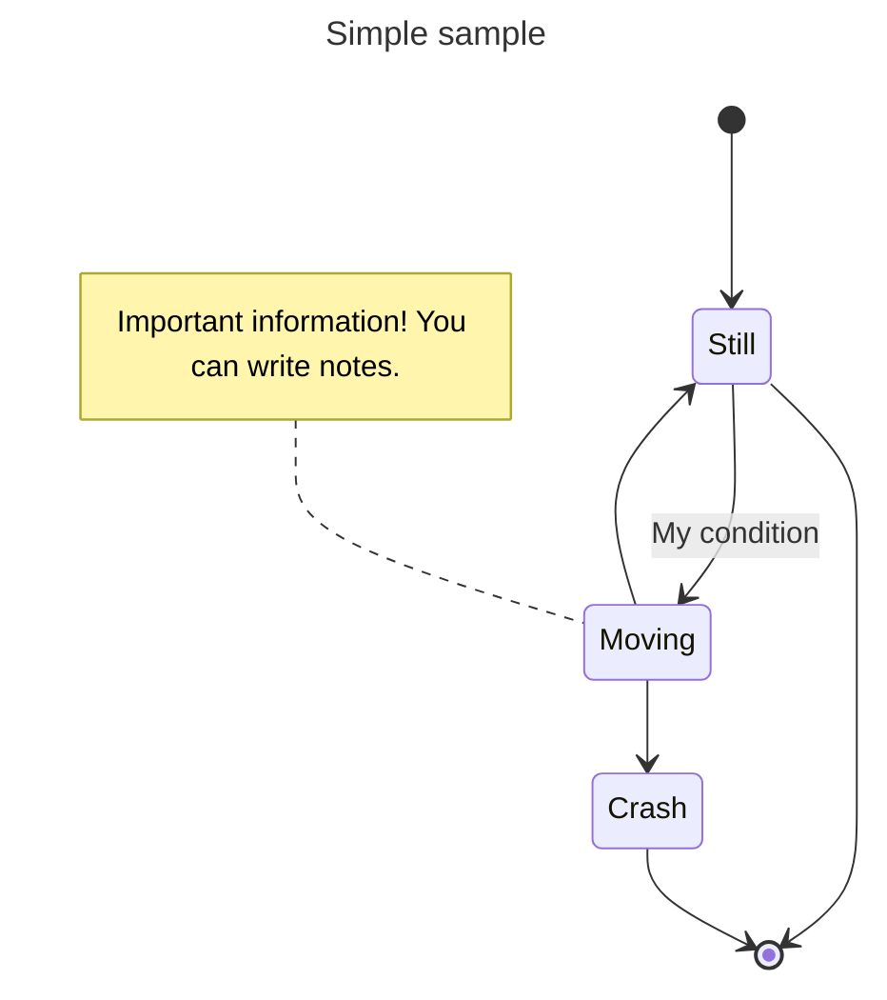

# To Do

# Une première modification!

# Passer les schmas PUML en Mermaid.
Il faut un quick start Mermaid pour State Machine

[Mon Lien sur la page : (#...)](#siemens-s7)

[Tutorial Mermaid State Machine (https:....)](https://mermaid.js.org/syntax/stateDiagram.html)


[Lien sur une autre page (....)](QuickStart_ctrlX_PLC.md)

## Une figure

<figure>
    
    <figcaption>Quick start to AutB</figcaption>
</figure>


[Tutorial Mermaid State Machine (https:....)](https://mermaid.js.org/syntax/stateDiagram.html)




Le dossier puml devrait ensuite pouvoir être supprimé.


# Il faut savoir utiliser les base de VS-Code avec Markdown.

## Liste des Plugin pour VS-Code

### Preview du Markdown : Ctrl + Shift + V
Il faut un quick start pour expliquer comment les installer.

-   GitHub Copilot
-   GitHub Copilot Chat
-   Markdown All In One
-   Markdown Preview Enhanced
-   Markdown Preview Mermaid Support
-   Structured Text language Support


```iecst
(*
	Practical Work 01 / Write your first PLC Code here

	www.hevs.ch
	Institut Systemes Industriels
	Project: 	HEVS Pack 2022
	Author:		Cedric Lenoir / Christophe Truffer
	Date:		2025 January 29
*)
PROGRAM PRG_Student
VAR
	uliLoop		: ULINT;
	MyButton	: BOOL;
END_VAR

```


# Liste des plugin pour Node-red
Il faut un quick start pour installer Node-RED, sachant que Node.JS est déjà présent sur chaque PC.

Il suffit en principe de taper dans le terminal de commande, Touche Windows --> cmd

```
npm install -g --unsafe-perm node-red
```

## Liste des plugin pour Node-RED
A droite, palette

-   @flowfuse/node-red-dashboard

-   node-red-contrib-ctrlx-automation

## Fichier flows.json
Le fichier ...\autb-lab-01_2025\node_red_base\flows.json () est à placer dans le répertoire:

C:\Users\your_name\.node-red

cmd line: C:\Users\your_name>node-red

puis: ``localhost:1880``

# Siemens S7
Normalement le PLC S7 est installé, si nécessaire, le programmes est : AuBoxPn_128_InOut_Beta_2

# CtrlX Core
Toujours extraire le projet dans le répertoire AutB (A créer).

``C:\Users\your_name\Documents\AutB``

``afd``

```mermaid

```

```ìecst

```

